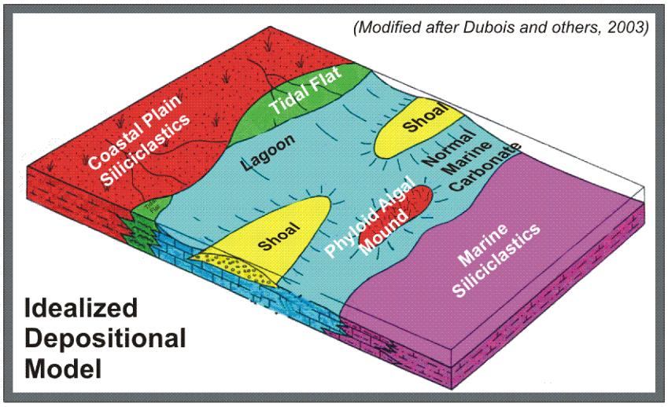

# Facies-Classification

L.T. Ozgur Yildirim

### Index:

* [Purpose of the study](#section1)
* [Materials and Methods](#section2)
* [License](#section3)

### Purpose of the study
The ultimate goal of this  project is to classify facies penetrated by oil and gas wells in the Panoma Gas Field in the southwest Kansas, USA. R programming language is used to implement seven supervised machine learning classifiers.

### Files
Files include R markdown and html files of the project.

### Materials and Methods
The Panoma gas field is situated in Southwest Kansas in the United States. The original dataset includes well log data acquired in 9 wells. The dataset comprises 4149 rows and 11 columns. Variables are sampled at half-foot (0.15 m) intervals. The predictor variables are quantitative conventional well log data such as depth (DEPTH), gamma ray (GR), resistivity (ILD_LOG10), photoelectric effect (PE), neutron-density porosity difference (DELTAPHI), and average neutron-density porosity (PHIND); and two geologic constraining variables: non-marine– marine indicator (NM–M) and relative position (RELPOS). The response variable is categorical. In the original dataset, there are nine facies classes in the response variable. For our modeling purposes, f_clastic_carb is created to be used as categorical response variable. The f_clastic_carb variable is classified into clastics (0) and carbonates (1) facies. The NM–M and RELPOS variables are not used in the modeling since we use wireline log measurements and depth as predictors.

The facies are classified by performing five-fold cross validation for seven supervised machine learning classifiers. These classifiers will include Generalized Additive Models (GAM), Multivariate Adaptive Regression Splines (MARS), Classification and Regression Trees (CART), Bootstrap Aggregating (Bagging), Random Forest Classifier, Bayesian Adaptive Regression Trees (BART), and Support Vector Machines (SVM).

### The Best Model
Gas production in the Panoma Field is from carbonate reservoirs deposited in a proximal, shallow position on a gently dipping ramp (Bohling and Dubois, 2003). In this case, the GAM model is the best model since it yielded the highest accuracy and f1 score (harmonic average of precision and sensitivity) among the models evaluated (Figures 18-20 and 22). This indicates that the GAM model classifies the carbonate facies better than the other models. Additionally, GAM model is easy to interpret, computationally efficient, and reproducibility is high compared to more complex ensemble methods.

### License
This project is my final project for EME 597-004 Data Analytics for Earth and Energy Systems course given in Energy and Mineral Engineering Department of the Penn State University. This is an educational project; therefore, all materials are free to be used.
